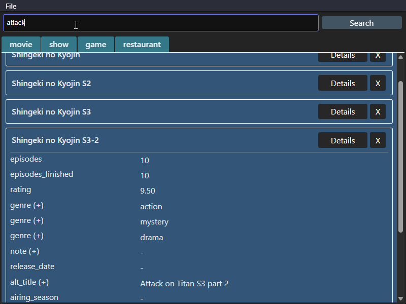

# TaurEAV

Desktop web app duplicate of [EAV-table-app](https://github.com/sinsinkun/EAV-table-app)

- UI is cleaned up to more closely resemble native apps
- Added searchbar (regex enabled, case insensitive)
- Search for attribute values with "attr: value"

Note: the console keeps the MySQL service running, do not close it

## Installation
- Install local MySQL server (8.0+)
- Run setup.sql in local MySQL database
- `npm i`
- `npm run tauri build`
- Optional: Add .env file to same folder as .exe with `DATABASE_URL={{mysql_url}}`
  - Will use MySQL default if not provided

## Future ideas
- Add units for float/int fields to value_str (front end)