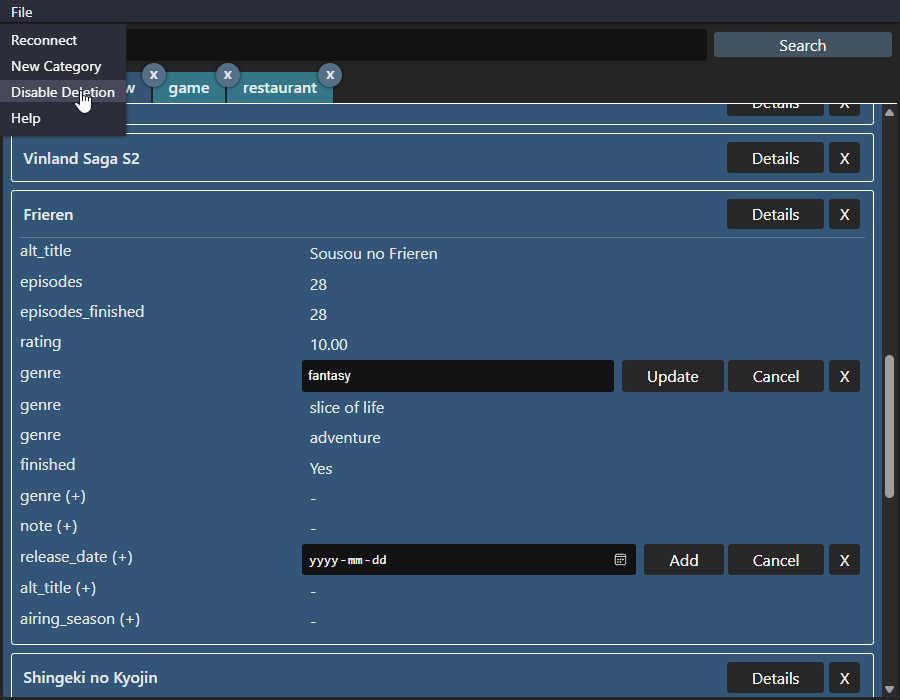

# TaurEAV

Desktop web app duplicate of [EAV-table-app](https://github.com/sinsinkun/EAV-table-app)

UI is cleaned up to more closely resemble native apps

# Installation
- `npm i`
- `npm run tauri build`
- Optional: Add .env file to same folder as .exe with `DATABASE_URL={{mysql_url}}`
  - Will use MySQL default if not provided